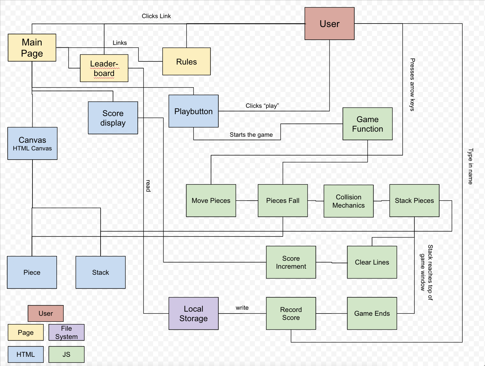
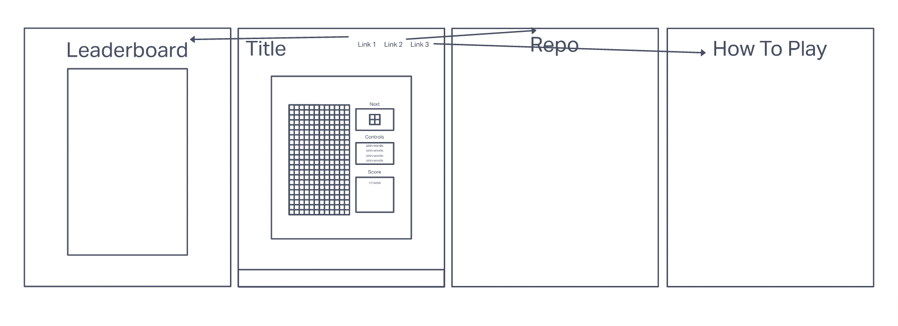

# README

## Tetris Site

### Collaborators: Julian Barker, Mehtab Riar, Chris Hollis, Cianenry Danan

## About

This repo contains our final project for Code 201. The goal is to recreate Tetris in a webpage using what we've learned so far about HTML, CSS, and JS. We will use localStorage to track scores and any user settings.

### Domain Model

### Wireframe

